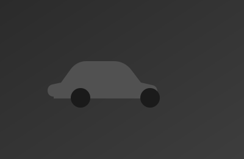

# Taller Hot Wheels — By Adri, Feli & Jeremy

Sitio web de una sola página para el taller familiar de restauración y modificación de Hot Wheels, ubicado en Heredia, Costa Rica.

Sitio estático (HTML + CSS + JS puro, sin frameworks ni build step), mobile-first y responsivo, listo para publicarse con **GitHub Pages** directamente desde este repositorio.

## Estructura del proyecto

```
index.html
assets/
  css/styles.css      → todos los estilos (tokens de color, tipografía, layout)
  js/main.js           → menú móvil, slider antes/después, animaciones de scroll
  img/
    logo.png            → logo oficial con fondo transparente
    logo-512.png         → versión usada como favicon / ícono
    car-silhouette.svg   → ícono genérico usado en las tarjetas de Showroom
    placeholder-before.svg / placeholder-after.svg → imágenes de muestra del slider Workshop
    team-silhouette.svg  → ilustración placeholder de "Sobre Nosotros"
    showroom/             → ⚠️ carpeta a crear: fotos reales del Showroom
    workshop/              → ⚠️ carpeta a crear: fotos antes/después del Workshop
```

## Ver el sitio en tu computadora

No necesitas instalar nada. Dos opciones:

1. **Doble clic en `index.html`** y se abre en el navegador.
2. O, si tienes Python instalado, desde esta carpeta corre:
   ```
   python3 -m http.server 8000
   ```
   y abre `http://localhost:8000` en el navegador.

## Publicar en GitHub Pages

1. Sube todos estos archivos a la rama `main` del repositorio `TallerHotwheels` (raíz del repo, no en una subcarpeta).
2. En GitHub, ve a **Settings → Pages**.
3. En "Build and deployment", elige **Deploy from a branch**, rama `main`, carpeta `/ (root)`.
4. Guarda. En uno o dos minutos el sitio queda publicado en `https://nelsystems77.github.io/TallerHotwheels/`.

Cada vez que subas cambios a `main`, el sitio se actualiza solo.

## Cómo reemplazar las fotos de muestra

El sitio funciona perfecto tal cual, pero hoy usa **ilustraciones de muestra** en tres lugares. Para que se vea 100% real, reemplázalas así:

### 1. Showroom (los 6 autos terminados)
En `index.html`, busca cada bloque `<article class="hw-card reveal">`. Dentro de `.hw-card-window` cambia:
```html

```
por, por ejemplo:
```html

```
Foto ideal: cuadrada o 4:3, buena luz, fondo limpio. Aprovecha y cambia también el título, la cinta roja (nombre del proyecto) y las etiquetas.

### 2. Workshop (comparador antes / después)
Busca el bloque `id="compare-demo"` y reemplaza:
```html

...

```
por tus dos fotos reales (mismo ángulo y encuadre en ambas para que la comparación se vea bien).

### 3. Sobre Nosotros (foto de Adri, Feli y Jeremy)
Busca `team-silhouette.svg` dentro de la sección `id="nosotros"` y cámbialo por una foto del taller o de los tres trabajando.

> 👉 Cuando tengas las fotos listas, puedes compartirlas y se integran directamente en el código.

## Datos de contacto ya configurados

- **WhatsApp:** +506 8828 5668 (botón flotante + sección de contacto)
- **Ubicación:** Heredia, Costa Rica (con mapa embebido)
- **Envíos:** Correos de Costa Rica y Uber Flash

Para cambiar el número de WhatsApp, busca `50688285668` en `index.html` (aparece en 3 lugares) y reemplázalo.

## Notas técnicas

- Sin dependencias externas salvo Google Fonts (Anton, Caveat, Inter) — si no hay internet, el navegador usa una tipografía similar de respaldo.
- El mapa de Heredia usa un iframe público de Google Maps (no requiere API key).
- Todo el sitio respeta `prefers-reduced-motion` y tiene foco visible para navegación con teclado.
